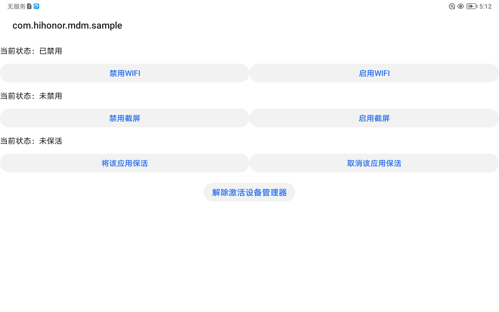

# MDMEngineDemo

## Table of Contents

 * [Introduction](#Introduction)
 * [Supported Environments](#Supported)
 * [Result](#Result)
 * [License](#License)

## Introduction
    The MDM Engine, including the device management API and the application rights management API, provides system-level authority management for applications installed on Honor devices.

## Supported Environments
    Hardware requirements:
       1. Honor mobile phone.

   	Software requirements:
        1. JDK 1.8 or later
        2. Android API 17 or later
        3. Android Studio 3.2 or later. This cases related to this guide run on Android Studio 3.5.

## Result

 

## License
The sample code is licensed under [Apache License 2.0](http://www.apache.org/licenses/LICENSE-2.0).